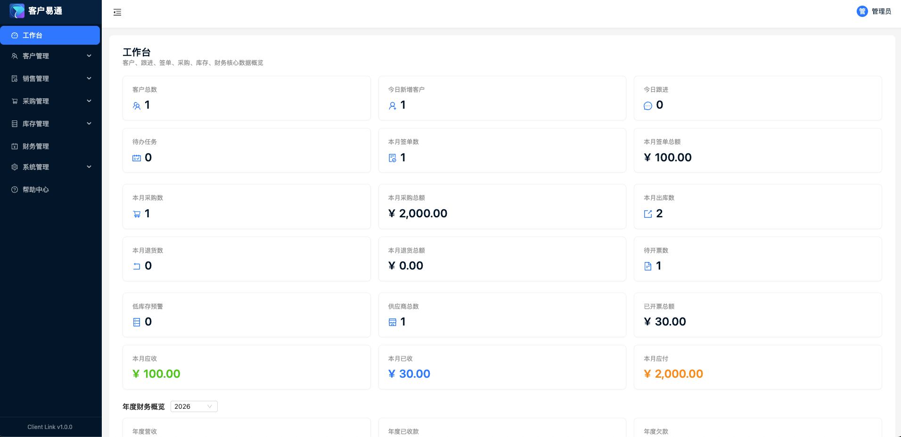
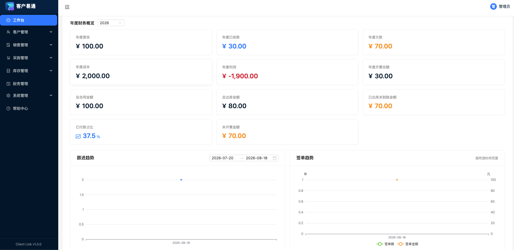
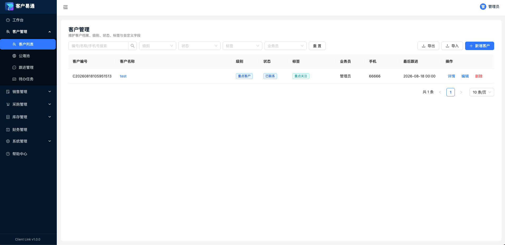
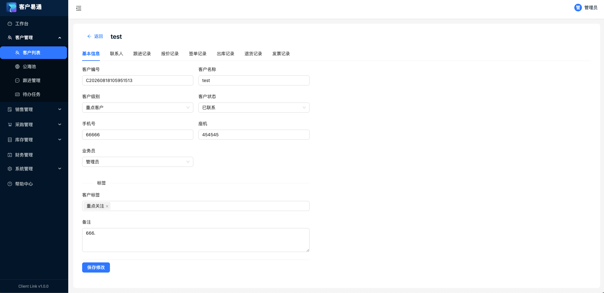
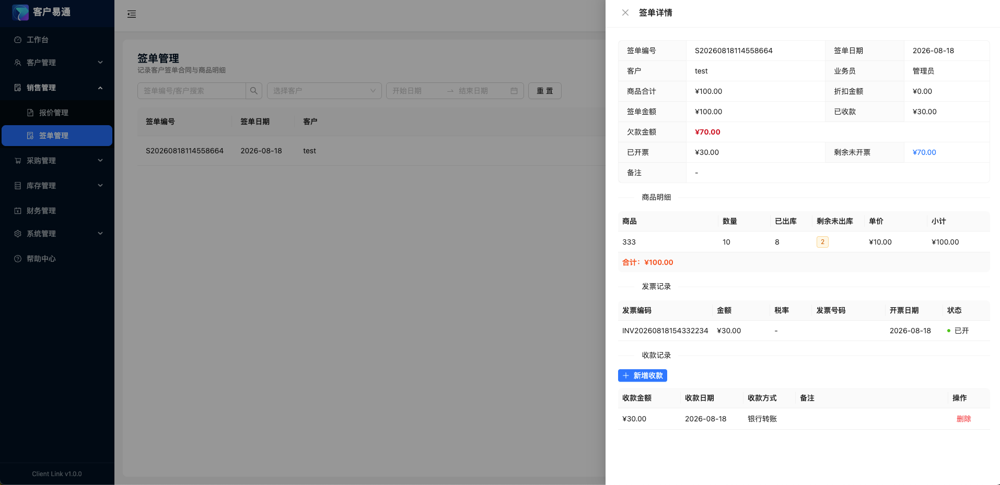
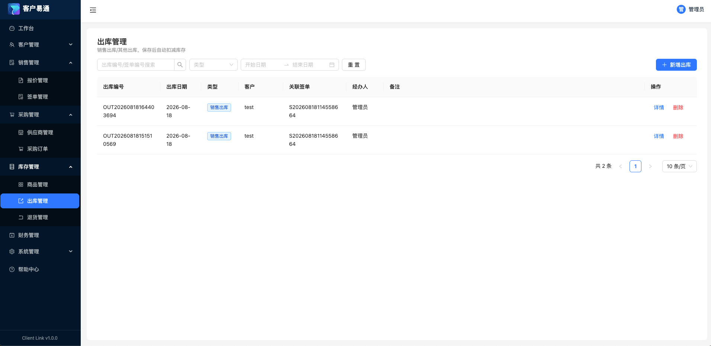
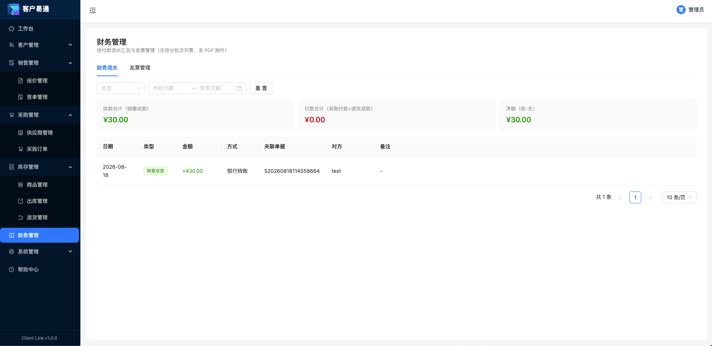
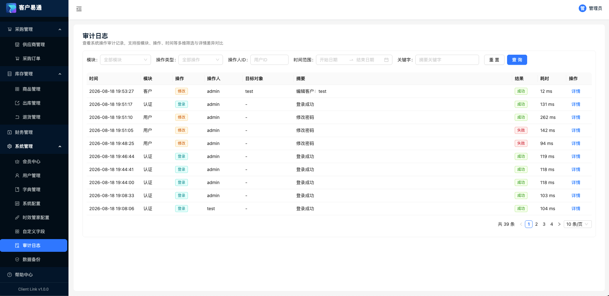

# 客户易通（ClientLink）

> 一款面向个人与小微团队的轻量级客户关系管理系统（CRM），集客户管理、跟进拜访、待办提醒、报价签单、采购库存、财务发票与报表看板于一体，帮助你把散落在通讯录、聊天记录和纸质合同里的客户线索集中管理，减少遗忘与疏漏。

---

## 一、项目概述

**客户易通**以「客户」为核心，覆盖销售全生命周期的一站式管理。从潜在客户的录入、分级、跟进，到报价、签单、回款，再到采购、出入库、财务统计，全程在一个系统内完成，并在关键节点自动生成待办提醒，让每一位客户都能得到及时跟进。

- **当前版本**：v1.0.0
- **默认账号**：`admin` / `admin123`
- 支持数据定时备份，保障经营数据安全

> ### 公众号：大白聊技术
>
> 欢迎关注「大白聊技术」公众号，第一时间获取产品更新动态、使用技巧与更多实用工具分享。

---

## 二、Docker 部署

支持通过 Docker 一键部署，数据持久化到宿主机目录，方便备份与迁移。

```yaml
services:
  client-link:
    image: dabaio/client-link:latest  
    ports:
      - "15810:15810"
    volumes:
      - ./data:/app/data              # 数据目录
      - ./backups:/app/backups        # 备份目录，单独分开
    environment:
      - TZ=Asia/Shanghai
    container_name: client-link
    restart: unless-stopped
```

启动服务：

```bash
docker compose up -d
```

> 提示：容器内服务默认监听 `15810` 端口

---

## 三、核心特性

- **客户全生命周期管理**：客户编号、级别（H/A/B/C/D）、状态、标签、联系人、自定义字段，均可灵活配置。
- **智能回访提醒**：按客户级别回访周期自动生成待办，配合「手动创建 / 跟进生成 / 级别回访」三种任务来源，到点提醒不遗漏。
- **进销存一体化**：商品、采购、出库、退货全程联动，一条单据自动增减库存，库存不足即时拦截。
- **财务管理**：销售收款、采购付款、退货退款三类流水聚合，发票分批次开票并自动校验剩余额度。
- **权限分级**：管理员 / 业务员两种角色，业务员只看自己的数据，采购、财务、系统配置仅管理员可用。
- **审计与备份**：全量操作审计日志 + 可配置定时备份，数据可追溯、可恢复。
- **数据导入导出**：客户、签单、跟进记录 Excel 批量导入导出，模板一键下载。

---

## 四、功能模块详解

### 1. 工作台

首页集中展示当日最需要关注的经营数据：

- 概览卡片：客户总数、今日新增、今日跟进、待办任务、本月签单数与金额等关键指标。
- 趋势图表：跟进趋势、签单趋势折线图，采购趋势、出库趋势柱状图，经营走势一目了然。
- 客户分布：客户级别、客户状态分布可视化，快速掌握客户结构。
- 业务员排名：按签单数量与金额排行，便于绩效管理（仅管理员可见）。





### 2. 客户管理

客户档案的集中管理中心：

- 客户编号可手动输入或按规则自动生成。
- 客户级别 H/A/B/C/D 分级，不同级别对应不同回访周期，自动驱动回访任务。
- 客户状态采用「跟进 / 签单 / 输单 / 无效」四大类树形字典，大类固定、小类可增删改。
- 标签动态多选（重点关注、VIP、潜在、已成交等），列表可按标签筛选。
- 自定义字段：管理员可在不修改代码的情况下扩展微信号、邮箱、QQ、公司地址等字段。
- 公海池：超过 N 天未跟进的客户自动进入公海，所有业务员可认领；一天不维护，客户不流失。





### 3. 联系人管理

一个客户可关联多个联系人，在客户详情页内嵌管理：

- 记录姓名、手机、座机、邮箱、职位等基本信息。
- 每个客户仅有一个默认联系人，设为新默认时原默认自动取消。
- 删除客户时级联删除其联系人，客户表「默认联系人」自动同步。

### 4. 跟进管理

完整记录每一次客户触达：

- 跟进类型动态配置（打电话、发微信、拜访、发邮件等）。
- 支持现场拍照、附件上传、洽谈录音、地理位置定位。
- 填写「下次跟进时间」自动生成一条回访任务。
- 跟进时可同步更新客户的小类状态与标签，一次拜访完成多处更新。
- 跟进列表按客户维度查看时间线，历史沟通一目了然。

### 5. 待办任务

把「什么时候该做什么」交给系统：

- 三种来源：手动创建、跟进生成、客户级别自动回访。
- 任务关联客户、负责人、参与人员，支持常用主题快速选择。
- 到点提醒（前端弹窗 + 可选外部推送），支持标记完成、延期。
- 业务员只看自己的任务，管理员看全部。

### 6. 报价管理

销售前期的报价与跟进：

- 商品明细、折扣、有效期，报价金额自动计算。
- 状态跟踪：待回复 / 已成交 / 已失效。
- 已成交报价可一键转为签单，客户、业务员、商品明细自动带出，减少重复录入。

### 7. 签单管理

成交与回款的核心单据：

- 签单金额 = 商品合计 - 折扣金额，系统自动计算。
- 支持多笔收款记录，已收款自动累加、欠款自动递减，欠款红色高亮、结清绿色显示。
- 可上传合同文件、客户证件、签约合影等材料。
- 签单时客户状态可联动更新为「已签约」。



### 8. 采购管理

供应商与采购进销存：

- 供应商增删改查，删除前校验采购订单引用。
- 采购订单含商品明细、付款记录，采购金额自动计算。
- 「确认入库」自动增加各商品库存，并生成采购来源的入库流水。
- 采购付款计入财务流水（支出方向），已入库订单禁止删除。

### 9. 库存管理

商品与库存一体化管理：

- 商品管理：照片、分类、单位、销售单价，库存由入库记录累计。
- 入库来源统一：手动入库、采购入库、销售退货入库。
- 出库管理：销售出库 / 其他出库，保存自动扣减库存，库存不足整单失败。
- 退货管理：销售退货 / 采购退货，保存自动回补或扣减库存。
- 所有库存变动事务化执行，失败整体回滚，保证流水可追溯。



### 10. 财务管理

经营收支的一站式视图（仅管理员可见）：

- 财务流水：销售收款、采购付款、退货退款三类流水聚合，收款 / 付款 / 净额统计卡片。
- 发票管理：销售发票 / 采购发票，分批次开票，自动校验剩余可开票金额。
- 多 PDF 附件上传 / 下载，发票编辑、作废、删除全程留痕。



### 11. 系统管理

系统级配置与基础数据维护（仅管理员可见）：

- 用户管理：业务员账号增删改查、重置密码、启用 / 禁用。
- 字典管理：客户级别、状态、标签、跟进类型、商品分类 / 单位、任务常用主题等统一维护。
- 自定义字段：灵活扩展客户字段。
- 系统配置：公海池回收天数、各类编号前缀生成规则等。

### 12. 审计日志与数据备份

安全与合规的两道防线：

- 审计日志：基于 AOP 无侵入记录全量写操作，操作人、时间、IP、变更前后快照、字段级 Diff 一目了然，异步落库不影响性能。
- 数据备份：可配置定时备份，将数据库与上传文件打包为 zip 并迁移到指定目录，支持保留策略与手动立即备份。



### 13. 外部集成

- SSO 互通（可选）：与时效管家双向免登录，共享账号体系，默认关闭，独立部署互不影响。
- 任务 Webhook：客户易通待办 / 回访任务可同步推送至时效管家，到期提醒更及时，外部服务不可用时主业务不受影响。

---

## 五、使用建议

1. **首次登录**后先在「系统管理」修改默认密码，并按需配置公海池回收天数、编号前缀。
2. 在「系统管理 → 自定义字段」中按业务补充客户扩展字段，录入客户时即可一次填全。
3. 客户级别对应回访周期，建议在「字典管理」中按团队习惯微调，让自动回访更贴合实际。
4. 常用客户记得补全联系人与「下次跟进时间」，系统会自动生成回访待办，减少遗忘。
5. 开启「数据备份」并设置合理的保留数量，重要经营数据定时兜底。

---

## 六、项目愿景

客户易通希望成为小微团队经营里的「客户小助手」，把散落在通讯录、聊天记录、Excel 与纸质单据里的客户线索统一起来，通过自动回访、到期提醒与进销存财务联动，让每一个商机都被及时跟进、每一笔收支都清晰可查。

如果你在使用过程中遇到 bug 或有新功能建议，欢迎通过 Issue 反馈。